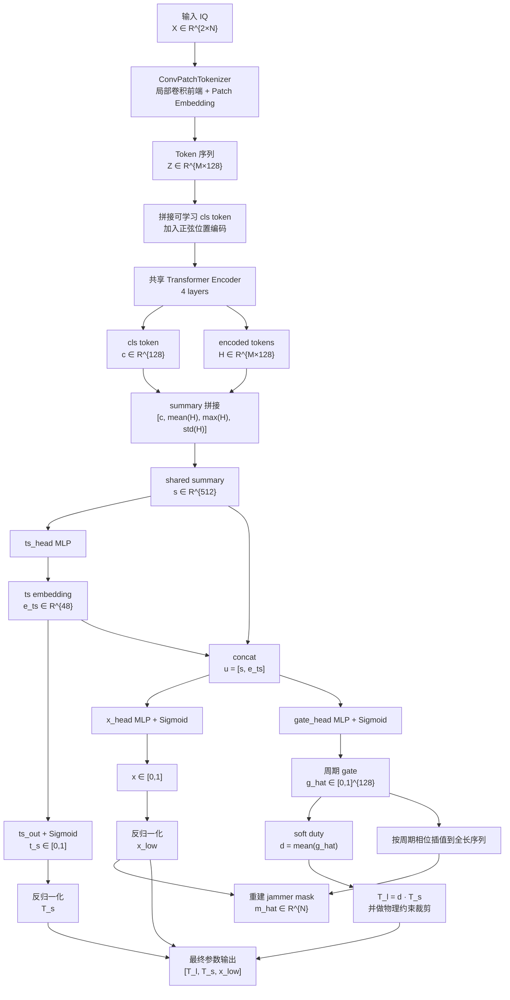

# 当前模型计算流程说明

本文档只讲当前实际使用的模型 `gate_reconstruction`，对应配置见 `configs/train.yaml`。  
不涉及仓库中未启用的旧模型或未使用分支。

## 1. 任务定义

模型输入是一段接收信号的 IQ 序列，目标是估计三个物理参数：

- 切片宽度：$T_l$
- 采样周期：$T_s$
- 低散射平台系数：$x_{\text{low}}$

记单个样本的输入为

$$
\mathbf{X} \in \mathbb{R}^{2 \times N}
$$

其中：

- 第 1 通道是归一化后的实部
- 第 2 通道是归一化后的虚部
- 当前配置中 $N=4000$

输出目标为

$$
\mathbf{y} = [T_l,\; T_s,\; x_{\text{low}}] \in \mathbb{R}^3
$$

与直接回归这三个量不同，当前模型先重建一个周期门控表示，再从中解码出物理参数。

## 2. 输入表示

原始接收复信号记为

$$
r[n] = r_{\Re}[n] + j\,r_{\Im}[n], \quad n = 0,1,\dots,N-1
$$

用数据集统计得到的尺度因子 $s>0$ 做归一化后，模型输入为

$$
\mathbf{X} =
\begin{bmatrix}
r_{\Re}[0]/s & r_{\Re}[1]/s & \cdots & r_{\Re}[N-1]/s \\
r_{\Im}[0]/s & r_{\Im}[1]/s & \cdots & r_{\Im}[N-1]/s
\end{bmatrix}
$$

单样本张量形状：

$$
(2, N)
$$

批量输入形状：

$$
(B, 2, N)
$$

## 3. 模型总结构

整体计算链路可以写成：

$$
\mathbf{X}
\xrightarrow{\text{ConvPatchTokenizer}}
\mathbf{Z}
\xrightarrow{\text{Shared Transformer}}
(\mathbf{c}, \mathbf{H})
\xrightarrow{\text{summary}}
\mathbf{s}
\xrightarrow{\text{three heads}}
(\hat{t}_s,\hat{x},\hat{\mathbf{g}})
\xrightarrow{\text{physical decode}}
(\hat{T}_l,\hat{T}_s,\hat{x}_{\text{low}})
$$

其中：

- $\mathbf{Z}$ 是 patch token 序列
- $\mathbf{c}$ 是全局 `cls` token
- $\mathbf{H}$ 是编码后的 token 序列
- $\mathbf{s}$ 是全局汇总特征
- $\hat{t}_s$ 是归一化周期预测
- $\hat{x}$ 是归一化低平台预测
- $\hat{\mathbf{g}}$ 是离散周期 gate

## 4. 卷积 tokenizer

### 4.1 局部特征提取

输入 $\mathbf{X}\in\mathbb{R}^{B\times 2\times N}$ 先经过两层一维卷积前端，得到局部特征：

$$
\mathbf{F}_{\text{local}} = f_{\text{stem}}(\mathbf{X})
$$

当前配置下输出形状为：

$$
\mathbf{F}_{\text{local}} \in \mathbb{R}^{B \times 32 \times N}
$$

这里的设计意图是先让卷积提取局部时域纹理，再交给 Transformer 做长程依赖建模。

### 4.2 Patch 嵌入

之后用步长卷积把长序列切成 patch token：

$$
\mathbf{Z}' = \operatorname{Conv1D}_{\text{patch}}(\mathbf{F}_{\text{local}})
$$

再做转置与归一化：

$$
\mathbf{Z} = \operatorname{LayerNorm}\bigl(\operatorname{Transpose}(\mathbf{Z}')\bigr)
$$

当前参数：

- patch size = 16
- patch stride = 16
- hidden size = 128

因此当 $N=4000$ 时，token 数约为

$$
M = \left\lfloor \frac{4000-16}{16} \right\rfloor + 1 = 250
$$

所以：

$$
\mathbf{Z} \in \mathbb{R}^{B \times 250 \times 128}
$$

## 5. 共享 Transformer 编码器

### 5.1 加入 `cls` token 和位置编码

对 token 序列加入一个可学习全局 token：

$$
\mathbf{z}_{\text{cls}} \in \mathbb{R}^{1 \times 128}
$$

再给序列 token 加正弦位置编码：

$$
\mathbf{P} \in \mathbb{R}^{250 \times 128}
$$

拼接后的输入为：

$$
\tilde{\mathbf{Z}} =
\begin{bmatrix}
\mathbf{z}_{\text{cls}} \\
\mathbf{Z} + \mathbf{P}
\end{bmatrix}
\in \mathbb{R}^{B \times 251 \times 128}
$$

### 5.2 Transformer 编码

共享编码器由 4 层 Transformer Encoder 组成：

$$
\mathbf{E} = \operatorname{TransformerEncoder}(\tilde{\mathbf{Z}})
$$

再做层归一化：

$$
\mathbf{E}_{\text{norm}} = \operatorname{LayerNorm}(\mathbf{E})
$$

拆分为：

$$
\mathbf{c} = \mathbf{E}_{\text{norm}}[:,0,:] \in \mathbb{R}^{B \times 128}
$$

$$
\mathbf{H} = \mathbf{E}_{\text{norm}}[:,1:,:] \in \mathbb{R}^{B \times 250 \times 128}
$$

其中：

- $\mathbf{c}$ 表示全局摘要
- $\mathbf{H}$ 保留逐 patch 的时序结构信息

## 6. 全局汇总特征

模型不会只用 `cls` token，而是把 token 序列做三种统计，再和 `cls` 拼接。

定义：

$$
\boldsymbol{\mu} = \frac{1}{M}\sum_{i=1}^{M}\mathbf{H}_i
$$

$$
\boldsymbol{\nu} = \max_{1 \le i \le M} \mathbf{H}_i
$$

$$
\boldsymbol{\sigma} = \operatorname{Std}(\mathbf{H}_1,\dots,\mathbf{H}_M)
$$

最后构造摘要向量：

$$
\mathbf{s} = [\mathbf{c},\boldsymbol{\mu},\boldsymbol{\nu},\boldsymbol{\sigma}]
$$

因此：

$$
\mathbf{s} \in \mathbb{R}^{B \times 512}
$$

这一步的含义是同时保留：

- 全局语义：$\mathbf{c}$
- 平均趋势：$\boldsymbol{\mu}$
- 峰值响应：$\boldsymbol{\nu}$
- 波动强度：$\boldsymbol{\sigma}$

## 7. Timing Head：预测采样周期

第一条支路先生成一个 timing embedding：

$$
\mathbf{e}_{ts} = \phi_{ts}(\mathbf{s}) \in \mathbb{R}^{B \times 48}
$$

其中 $\phi_{ts}$ 是两层 MLP。

然后输出归一化采样周期：

$$
\hat{t}_s = \sigma(\mathbf{W}_{ts}\mathbf{e}_{ts} + \mathbf{b}_{ts})
$$

所以：

$$
\hat{t}_s \in [0,1]^{B \times 1}
$$

再根据数据集定义的上下界做反归一化：

$$
\hat{T}_s = T_s^{\min} + \hat{t}_s\,(T_s^{\max} - T_s^{\min})
$$

当前数据范围是：

$$
T_s^{\min} = 1.0\ \mu s,\qquad T_s^{\max} = 10.0\ \mu s
$$

因此：

$$
\hat{T}_s \in \mathbb{R}^{B \times 1}
$$

## 8. Gate / Coefficient 联合解码

当前模型的关键点是：后续分支都不只看共享摘要 $\mathbf{s}$，还会复用 timing embedding $\mathbf{e}_{ts}$。

构造联合输入：

$$
\mathbf{u} = [\mathbf{s}, \mathbf{e}_{ts}] \in \mathbb{R}^{B \times 560}
$$

这意味着网络先形成“周期结构”的紧凑表示，再用它去解释低平台和 gate。

## 9. Coefficient Head：预测低平台系数

低平台支路输出归一化系数：

$$
\hat{x} = \phi_x(\mathbf{u}) \in [0,1]^{B \times 1}
$$

其中 $\phi_x$ 是 MLP + Sigmoid。

再反归一化得到物理量：

$$
\hat{x}_{\text{head}} = x^{\min} + \hat{x}\,(x^{\max} - x^{\min})
$$

当前范围为：

$$
x^{\min}=0,\qquad x^{\max}=0.5
$$

由于当前配置 `x_decode_mode = head`，所以最终使用的低平台预测就是：

$$
\hat{x}_{\text{low}} = \hat{x}_{\text{head}}
$$

这里没有启用其他混合或模板模式。

## 10. Gate Head：重建离散周期 gate

Gate 支路输出一个长度为 128 的周期门控向量：

$$
\hat{\mathbf{g}} = \phi_g(\mathbf{u}) \in [0,1]^{B \times K}
$$

其中当前

$$
K = 128
$$

写成元素形式就是：

$$
\hat{\mathbf{g}} =
\bigl[\hat{g}_1,\hat{g}_2,\dots,\hat{g}_{128}\bigr]
$$

每个 $\hat{g}_k$ 表示一个周期内第 $k$ 个离散相位位置的 gate 强度。

当前配置 `gate_representation = single_gate`，所以这里只输出单条 gate 曲线，不输出额外的低平台周期曲线。

## 11. 从 gate 解码切片宽度

模型不直接用一个 head 回归 $T_l$，而是先从 gate 求一个软占空比：

$$
\hat{d} = \frac{1}{K}\sum_{k=1}^{K}\hat{g}_k
$$

于是切片宽度由

$$
\hat{T}_l = \hat{d}\,\hat{T}_s
$$

得到。

这一步体现了模型的核心假设：

$$
\text{slice width} = \text{duty ratio} \times \text{period}
$$

随后代码还会加上物理约束，把 $\hat{T}_l$ 裁剪到允许范围内：

$$
T_l^{\min} \le \hat{T}_l \le \min\bigl(T_l^{\max},\; \hat{T}_s - \Delta_{\min}\bigr)
$$

其中当前：

$$
T_l^{\min}=0.4\ \mu s,\quad
T_l^{\max}=4.0\ \mu s,\quad
\Delta_{\min}=0.2\ \mu s
$$

这保证预测不会违反数据集定义的最小间隔约束。

## 12. 从离散周期 gate 重建完整时间掩码

训练时不只监督三个参数，还要监督完整 jammer mask。  
因此需要把一个周期内的离散 gate $\hat{\mathbf{g}}$ 插值成整段长度为 $N$ 的时间序列。

### 12.1 周期相位归一化

对第 $n$ 个采样点，先计算相对时间：

$$
t_n = \frac{n}{f_s}
$$

考虑 jammer 延迟 $\tau_j$ 后，周期相位为：

$$
\rho_n = \frac{\operatorname{mod}\bigl(\max(t_n-\tau_j,0),\; \hat{T}_s\bigr)}{\hat{T}_s}
$$

所以：

$$
\rho_n \in [0,1)
$$

### 12.2 映射到离散 gate bins

把相位映射到离散索引：

$$
p_n = \rho_n (K-1)
$$

取相邻整数索引：

$$
i_n^{\text{low}} = \lfloor p_n \rfloor,\qquad
i_n^{\text{high}} = \min(i_n^{\text{low}}+1,\; K-1)
$$

线性插值系数：

$$
\alpha_n = p_n - i_n^{\text{low}}
$$

于是连续时间上的 gate 值为：

$$
\hat{g}(t_n) =
\hat{g}_{i_n^{\text{low}}}
+ \alpha_n \bigl(\hat{g}_{i_n^{\text{high}}} - \hat{g}_{i_n^{\text{low}}}\bigr)
$$

### 12.3 形成完整 jammer mask

最终重建的完整掩码为：

$$
\hat{m}[n] =
\hat{x}_{\text{low}} + \bigl(1-\hat{x}_{\text{low}}\bigr)\hat{g}(t_n)
$$

因此：

$$
\hat{\mathbf{m}} \in \mathbb{R}^{B \times N}
$$

这就是训练时用来对齐真值 `jammer_mask` 的重建结果。

## 13. 模型最终输出

从网络原始输出到物理解码后的最终结果，可整理为：

$$
\hat{t}_s,\hat{x},\hat{\mathbf{g}}
\Longrightarrow
\hat{T}_s,\hat{x}_{\text{low}},\hat{T}_l,\hat{\mathbf{m}}
$$

更明确地写成：

$$
\hat{T}_s = T_s^{\min} + \hat{t}_s(T_s^{\max}-T_s^{\min})
$$

$$
\hat{x}_{\text{low}} = x^{\min} + \hat{x}(x^{\max}-x^{\min})
$$

$$
\hat{d} = \frac{1}{K}\sum_{k=1}^{K}\hat{g}_k
$$

$$
\hat{T}_l = \operatorname{clip}\bigl(\hat{d}\hat{T}_s,\; T_l^{\min},\; \min(T_l^{\max},\hat{T}_s-\Delta_{\min})\bigr)
$$

$$
\hat{\mathbf{y}} = [\hat{T}_l,\hat{T}_s,\hat{x}_{\text{low}}]
$$

## 14. 损失函数

当前训练损失由三部分组成：

$$
\mathcal{L}
=
\mathcal{L}_{\text{reg}}
\;+\;
\lambda_{\text{mask}}\mathcal{L}_{\text{mask}}
\;+\;
\lambda_{\text{tv}}\mathcal{L}_{\text{tv}}
$$

### 14.1 参数回归损失

对三个物理量做加权 Smooth L1：

$$
\mathcal{L}_{\text{reg}}
=
\frac{1}{3}
\sum_{i=1}^{3}
w_i \cdot \operatorname{SmoothL1}(\hat{y}_i, y_i)
$$

当前权重是：

$$
(w_{T_l}, w_{T_s}, w_{x}) = (2.5,\;1.0,\;1.5)
$$

也就是：

- 最重视切片宽度误差
- 其次重视低平台系数误差
- 采样周期权重相对较小

### 14.2 Mask 重建损失

用完整重建掩码去拟合真值掩码：

$$
\mathcal{L}_{\text{mask}}
=
\operatorname{SmoothL1}(\hat{\mathbf{m}}, \mathbf{m})
$$

其中：

- $\hat{\mathbf{m}}$ 是模型重建的 jammer mask
- $\mathbf{m}$ 是数据集真值 `jammer_mask`

### 14.3 TV 平滑损失

为了让周期 gate 不要在相邻 bin 上剧烈抖动，引入 total variation 正则：

$$
\mathcal{L}_{\text{tv}}
=
\frac{1}{K-1}
\sum_{k=1}^{K-1}
\left|\hat{g}_{k+1} - \hat{g}_k\right|
$$

### 14.4 当前配置下的总损失

当前超参数为：

$$
\lambda_{\text{mask}} = 1.0,\qquad
\lambda_{\text{tv}} = 0.02
$$

所以实际优化目标是：

$$
\mathcal{L}
=
\mathcal{L}_{\text{reg}}
1.0\cdot\mathcal{L}_{\text{mask}}
0.02\cdot\mathcal{L}_{\text{tv}}
$$

这说明当前模型不仅要把三个参数估计对，还要让“产生这些参数的周期门控结构”也尽量正确。

## 15. 计算逻辑总结

当前模型的核心计算逻辑可以压缩成 6 步：

1. 把双通道 IQ 序列切成 patch token。
2. 用共享 Transformer 提取全局周期结构表示。
3. 从共享表示得到采样周期 embedding。
4. 用该 embedding 联合解码低平台系数和周期 gate。
5. 用周期 gate 的平均值计算 duty，再解出切片宽度。
6. 把离散 gate 插值成完整时间掩码，并联合监督参数与门控形状。

用公式串起来就是：

$$
\mathbf{X}
\to
\mathbf{Z}
\to
(\mathbf{c},\mathbf{H})
\to
\mathbf{s}
\to
\mathbf{e}_{ts}
\to
(\hat{t}_s,\hat{x},\hat{\mathbf{g}})
\to
(\hat{T}_s,\hat{x}_{\text{low}},\hat{T}_l,\hat{\mathbf{m}})
$$

它和直接三输出回归器的本质差别是：

$$
\hat{T}_l
$$

不是一个独立 head 直接回归出来的，而是通过

$$
\hat{\mathbf{g}} \Rightarrow \hat{d} \Rightarrow \hat{T}_l
$$

间接得到。

因此这套模型不是“黑箱回归三个数”，而是“先恢复周期门控结构，再从该结构中解码物理参数”。

## 16. 架构图

下面给出与当前实现一致的整体架构图。Typora 支持 Mermaid 时可直接渲染。

