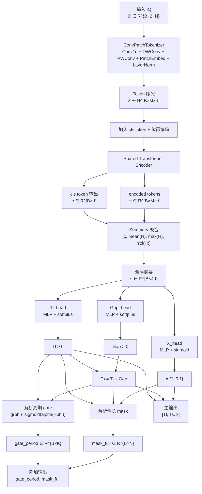

# 无数据集边界依赖的 Gate 重设计完整架构说明

## 1. 目标与约束

本文档描述的是**新重设计模型**，不是当前仓库中已经实现的 `gate_reconstruction` 版本。

新的模型目标是：

$$
\text{输入 IQ} \rightarrow \text{直接预测物理参数} \rightarrow \text{由物理参数解析生成 gate 和 mask}
$$

该模型必须满足以下原则：

1. 不使用任何数据集上下界作为输出头定义的一部分。
2. `gate` 必须保留，但 `gate` 只能作为**物理解释层**存在。
3. 模型主输出必须是物理参数本身，而不是数据集区间内的归一化坐标。
4. 整个结构必须从头到尾可解释，读者不看代码也能理解每一层的作用。

允许使用的约束只有两类：

- 物理或定义域必然约束
- 参数之间的结构关系

因此新模型只使用：

- `T_l > 0`
- `T_s > T_l`
- `x \in [0,1]`

不允许使用：

- `T_l^{min}, T_l^{max}`
- `T_s^{min}, T_s^{max}`
- `x^{min}, x^{max}`
- 任何来自数据集标注范围的裁剪公式作为主输出定义

---

## 2. 任务定义

模型输入是一段接收信号的 IQ 序列，输出三个物理参数：

- 切片宽度：$T_l$
- 采样周期：$T_s$
- 低平台系数：$x$

其中：

- $T_l$ 表示一个周期内高散射状态持续的时间
- $T_s$ 表示整个门控周期
- $x$ 表示低散射状态下的相对平台值

定义单样本输入：

$$
\mathbf{X} \in \mathbb{R}^{2 \times N}
$$

其中：

- 第 1 通道：IQ 实部
- 第 2 通道：IQ 虚部
- $N$ 为时间采样点数，当前数据设定下通常为 `4000`

批量输入为：

$$
\mathbf{X}_{batch} \in \mathbb{R}^{B \times 2 \times N}
$$

主输出为：

$$
\hat{\mathbf y} = [\hat{T}_l,\hat{T}_s,\hat{x}]
$$

辅助解释输出为：

- 周期 gate：$\hat{\mathbf g}$
- 全长 mask：$\hat{\mathbf m}$

---

## 3. 总体数据流

新架构的完整主链路为：

$$
\mathbf{X}
\xrightarrow{\text{ConvPatchTokenizer}}
\mathbf{Z}
\xrightarrow{\text{Shared Transformer Encoder}}
(\mathbf{c}, \mathbf{H})
\xrightarrow{\text{summary}}
\mathbf{s}
\xrightarrow{\text{parameter heads}}
(\hat{T}_l,\hat{T}_s,\hat{x})
\xrightarrow{\text{analytic decoder}}
(\hat{\mathbf g},\hat{\mathbf m})
$$

可拆成两条路径：

### 3.1 主参数路径

$$
\mathbf{X} \rightarrow \mathbf{s} \rightarrow (\hat{T}_l,\hat{T}_s,\hat{x})
$$

这条路径负责参数估计，是主任务。

### 3.2 解释路径

$$
(\hat{T}_l,\hat{T}_s,\hat{x}) \rightarrow \hat{\mathbf g} \rightarrow \hat{\mathbf m}
$$

这条路径不再依赖单独的神经网络 head，而是纯解析生成，用于：

- 物理解释
- 辅助监督
- 可视化输出

---

## 4. 模块级架构

## 4.1 输入表示层

### 4.1.1 作用

把复数 IQ 信号表示为双通道实值张量，交给后续神经网络处理。

### 4.1.2 输入

单样本：

$$
\mathbf{X} \in \mathbb{R}^{2 \times N}
$$

批量：

$$
\mathbf{X}_{batch} \in \mathbb{R}^{B \times 2 \times N}
$$

### 4.1.3 输出

与输入相同，作为后续 `ConvPatchTokenizer` 的输入。

### 4.1.4 备注

这里不引入额外 hand-crafted 特征，也不在新架构定义中绑定数据集归一化范围。  
任何数值标准化若需要存在，只能视为输入预处理，而不是模型结构的一部分。

---

## 4.2 ConvPatchTokenizer

### 4.2.1 作用

从原始 IQ 序列中提取局部时域模式，并把长序列切成 patch token，供 Transformer 处理。

### 4.2.2 模块组成

`ConvPatchTokenizer` 由以下子层组成：

1. `Conv1d(in_channels=2, out_channels=stem_channels, kernel_size=7, padding=3)`
2. `BatchNorm1d(stem_channels)`
3. `GELU`
4. `Depthwise Conv1d(stem_channels -> stem_channels, kernel_size=5, padding=2, groups=stem_channels)`
5. `Pointwise Conv1d(stem_channels -> stem_channels, kernel_size=1)`
6. `BatchNorm1d(stem_channels)`
7. `GELU`
8. `Patch Embedding Conv1d(stem_channels -> hidden_channels, kernel_size=patch_size, stride=patch_stride)`
9. `LayerNorm(hidden_channels)`

### 4.2.3 输入

$$
\mathbf{X}_{batch} \in \mathbb{R}^{B \times 2 \times N}
$$

### 4.2.4 中间输出

卷积前端输出局部特征：

$$
\mathbf{F}_{local} \in \mathbb{R}^{B \times C_s \times N}
$$

其中：

- $C_s = \text{stem\_channels}$

### 4.2.5 最终输出

经过 patch embedding 并转置后，得到 token 序列：

$$
\mathbf{Z} \in \mathbb{R}^{B \times M \times d}
$$

其中：

- $d = \text{hidden\_channels}$
- $M$ 为 patch 数量

当 `patch_size = patch_stride = 16` 且 `N = 4000` 时：

$$
M = \left\lfloor \frac{N - 16}{16} \right\rfloor + 1 = 250
$$

因此典型输出形状为：

$$
\mathbf{Z} \in \mathbb{R}^{B \times 250 \times 128}
$$

### 4.2.6 设计理由

- 卷积负责局部纹理和短时模式提取
- patch embedding 负责把长序列压缩成较短 token 序列
- 这样可以保留时序结构，同时控制 Transformer 的计算量

---

## 4.3 Shared Transformer Encoder

### 4.3.1 作用

对 patch token 做全局时序建模，提取周期性和长程依赖。

### 4.3.2 模块组成

`TransformerStage` 由以下部分组成：

1. 一个可学习的 `cls_token`
2. 一个正弦位置编码生成模块
3. `nn.TransformerEncoderLayer`
4. `nn.TransformerEncoder`
5. `LayerNorm`

### 4.3.3 输入

token 序列：

$$
\mathbf{Z} \in \mathbb{R}^{B \times M \times d}
$$

### 4.3.4 构造过程

首先引入可学习全局 token：

$$
\mathbf{z}_{cls} \in \mathbb{R}^{1 \times 1 \times d}
$$

复制到 batch 后：

$$
\mathbf{Z}_{cls} \in \mathbb{R}^{B \times 1 \times d}
$$

然后给 token 序列加位置编码：

$$
\mathbf{P} \in \mathbb{R}^{1 \times M \times d}
$$

拼接后形成 encoder 输入：

$$
\tilde{\mathbf{Z}} = [\mathbf{Z}_{cls},\; \mathbf{Z} + \mathbf{P}]
$$

因此：

$$
\tilde{\mathbf{Z}} \in \mathbb{R}^{B \times (M+1) \times d}
$$

### 4.3.5 输出

经过 encoder 和归一化后，拆分成：

全局 token：

$$
\mathbf{c} \in \mathbb{R}^{B \times d}
$$

所有普通 token：

$$
\mathbf{H} \in \mathbb{R}^{B \times M \times d}
$$

### 4.3.6 设计理由

- `cls token` 在编码过程中持续汇总全局信息
- 其余 token 保留逐 patch 的时序结构
- 适合后续做 sequence-level 参数预测

---

## 4.4 Summary 聚合层

### 4.4.1 作用

把 Transformer 的输出聚合成一个稳定的全局摘要向量，供参数头使用。

### 4.4.2 输入

- 全局 token：
  $$
  \mathbf{c} \in \mathbb{R}^{B \times d}
  $$
- token 序列：
  $$
  \mathbf{H} \in \mathbb{R}^{B \times M \times d}
  $$

### 4.4.3 聚合组成

对 $\mathbf H$ 做三种统计：

均值：

$$
\boldsymbol{\mu} = \operatorname{mean}(\mathbf{H}, \text{dim}=1)
$$

最大值：

$$
\boldsymbol{\nu} = \operatorname{max}(\mathbf{H}, \text{dim}=1)
$$

标准差：

$$
\boldsymbol{\sigma} = \operatorname{std}(\mathbf{H}, \text{dim}=1)
$$

然后拼接：

$$
\mathbf{s} = [\mathbf{c}, \boldsymbol{\mu}, \boldsymbol{\nu}, \boldsymbol{\sigma}]
$$

### 4.4.4 输出

$$
\mathbf{s} \in \mathbb{R}^{B \times 4d}
$$

当前 `d = 128` 时：

$$
\mathbf{s} \in \mathbb{R}^{B \times 512}
$$

### 4.4.5 设计理由

- `cls` 提供可学习的全局语义汇总
- `mean/max/std` 提供更稳定、显式的统计特征
- 比只用单一 `cls token` 更稳

---

## 4.5 参数头总览

新的参数头全部直接从 `summary` 预测物理参数：

$$
\mathbf{s} \rightarrow (\hat{T}_l,\hat{T}_s,\hat{x})
$$

不再经过：

- `gate -> duty -> Tl`
- `Tmin/Tmax` 映射
- `x_decode_mode`

---

## 4.6 `Tl_head`

### 4.6.1 作用

直接预测切片宽度 $T_l$。

### 4.6.2 模块组成

建议由一个小型 MLP 构成：

1. `Linear(4d -> d)`
2. `GELU`
3. `Dropout`
4. `Linear(d -> 1)`

记最后输出为：

$$
z_l \in \mathbb{R}^{B \times 1}
$$

### 4.6.3 输入

$$
\mathbf{s} \in \mathbb{R}^{B \times 4d}
$$

### 4.6.4 输出参数化

使用正值参数化：

$$
\hat{T}_l = \operatorname{softplus}(z_l)
$$

因此：

$$
\hat{T}_l > 0
$$

### 4.6.5 输出

$$
\hat{T}_l \in \mathbb{R}^{B \times 1}
$$

### 4.6.6 设计理由

- `softplus` 只引入“正值”这一物理约束
- 不依赖任何数据集上界或下界
- 让模型直接学物理量本身

---

## 4.7 `Gap_head`

### 4.7.1 作用

不直接预测 $T_s$，而是预测正的周期差值：

$$
\Delta = T_s - T_l
$$

### 4.7.2 模块组成

结构与 `Tl_head` 类似：

1. `Linear(4d -> d)`
2. `GELU`
3. `Dropout`
4. `Linear(d -> 1)`

输出为：

$$
z_g \in \mathbb{R}^{B \times 1}
$$

### 4.7.3 输入

$$
\mathbf{s} \in \mathbb{R}^{B \times 4d}
$$

### 4.7.4 输出参数化

先得到正 gap：

$$
\hat{\Delta} = \operatorname{softplus}(z_g)
$$

再定义周期：

$$
\hat{T}_s = \hat{T}_l + \hat{\Delta}
$$

因此天然满足：

$$
\hat{T}_s > \hat{T}_l
$$

### 4.7.5 输出

$$
\hat{T}_s \in \mathbb{R}^{B \times 1}
$$

### 4.7.6 设计理由

- 使用结构关系保证物理合法性
- 不再使用 `min_timing_gap_us`
- 不再依赖数据集定义的周期范围

---

## 4.8 `X_head`

### 4.8.1 作用

预测低平台系数 $x$。

### 4.8.2 模块组成

建议使用小型 MLP：

1. `Linear(4d -> d)`
2. `GELU`
3. `Dropout`
4. `Linear(d -> 1)`

输出：

$$
z_x \in \mathbb{R}^{B \times 1}
$$

### 4.8.3 输入

$$
\mathbf{s} \in \mathbb{R}^{B \times 4d}
$$

### 4.8.4 输出参数化

使用 sigmoid：

$$
\hat{x} = \sigma(z_x)
$$

因此：

$$
\hat{x} \in [0,1]
$$

### 4.8.5 输出

$$
\hat{x} \in \mathbb{R}^{B \times 1}
$$

### 4.8.6 设计理由

- `x` 是比例量，本身有定义域
- `[0,1]` 是变量物理定义，不是数据集边界

---

## 4.9 解析周期 gate 层

### 4.9.1 作用

由预测参数 $(\hat{T}_l,\hat{T}_s)$ 解析生成一个周期内的 gate 曲线。

它不再是神经网络 head，而是**physics layer**。

### 4.9.2 输入

- $\hat{T}_l \in \mathbb{R}^{B \times 1}$
- $\hat{T}_s \in \mathbb{R}^{B \times 1}$

### 4.9.3 中间变量

定义占空比：

$$
r = \frac{\hat{T}_l}{\hat{T}_s}
$$

其中：

$$
0 < r < 1
$$

定义周期离散点数：

$$
K = \text{gate\_bins}
$$

定义归一化周期相位：

$$
\phi_k = \frac{k}{K-1}, \qquad k=0,1,\dots,K-1
$$

### 4.9.4 输出公式

使用软门控形式：

$$
\hat{g}_k = \sigma\big(\alpha(r - \phi_k)\big)
$$

其中：

- `alpha` 为 gate 边界锐度超参数

于是得到：

$$
\hat{\mathbf g} = [\hat{g}_0,\hat{g}_1,\dots,\hat{g}_{K-1}]
$$

### 4.9.5 输出

$$
\hat{\mathbf g} \in \mathbb{R}^{B \times K}
$$

当前若 `K = 128`，则：

$$
\hat{\mathbf g} \in \mathbb{R}^{B \times 128}
$$

### 4.9.6 设计理由

- gate 的每个位置都对应“一个周期相位上的高/低散射状态”
- 可解释性强
- 避免当前实现中“黑箱 128 维 gate head”问题

---

## 4.10 解析全长 `mask_full` 层

### 4.10.1 作用

根据 $(\hat{T}_l,\hat{T}_s,\hat{x})$ 生成整段时间序列上的门控掩码。

### 4.10.2 输入

- $\hat{T}_l \in \mathbb{R}^{B \times 1}$
- $\hat{T}_s \in \mathbb{R}^{B \times 1}$
- $\hat{x} \in \mathbb{R}^{B \times 1}$
- `sample_rate_hz`
- `seq_len = N`
- `jammer_delay_s`

### 4.10.3 时间相位映射

对第 $n$ 个采样点：

$$
t_n = \frac{n}{f_s}
$$

相对时延修正后：

$$
t_n' = \max(t_n - \tau_j, 0)
$$

周期相位：

$$
\phi_n = \frac{\operatorname{mod}(t_n', \hat{T}_s)}{\hat{T}_s}
$$

### 4.10.4 mask 公式

先由相位计算 gate：

$$
g(\phi_n) = \sigma(\alpha(r - \phi_n))
$$

再生成全长 mask：

$$
\hat{m}[n] = \hat{x} + (1-\hat{x}) g(\phi_n)
$$

### 4.10.5 输出

$$
\hat{\mathbf m} \in \mathbb{R}^{B \times N}
$$

### 4.10.6 设计理由

- 与周期 gate 一致
- 可直接与真实 `jammer_mask` 对齐
- 形成参数与解释层的闭环

---

## 5. 新模型的整体输出对象

建议新的 prediction dataclass 至少包含：

- `slice_width_us`
- `sampling_interval_us`
- `modulation_floor`
- `gate_period`
- `mask_full`

对应记号：

$$
(\hat{T}_l,\hat{T}_s,\hat{x},\hat{\mathbf g},\hat{\mathbf m})
$$

其中：

- 前三项是主输出
- 后两项是可解释输出

---

## 6. 训练路径

## 6.1 前向流程

训练时单次前向为：

$$
\mathbf{X}
\rightarrow
\mathbf{Z}
\rightarrow
(\mathbf{c},\mathbf{H})
\rightarrow
\mathbf{s}
\rightarrow
(\hat{T}_l,\hat{T}_s,\hat{x})
\rightarrow
(\hat{\mathbf g},\hat{\mathbf m})
$$

### 6.2 主损失：参数回归

参数回归损失：

$$
\mathcal{L}_{param}
=
w_l \mathcal{L}_l
+
w_s \mathcal{L}_s
+
w_x \mathcal{L}_x
$$

其中：

- $\mathcal{L}_l$ 对应 $\hat{T}_l$ 与 $T_l$
- $\mathcal{L}_s$ 对应 $\hat{T}_s$ 与 $T_s$
- $\mathcal{L}_x$ 对应 $\hat{x}$ 与 $x$

推荐使用 `SmoothL1`。

### 6.3 辅助损失：mask 一致性

利用解析出的全长掩码与真实 mask 对齐：

$$
\mathcal{L}_{mask}
=
\operatorname{SmoothL1}(\hat{\mathbf m}, \mathbf m)
$$

### 6.4 可选辅助损失：周期 gate 一致性

由真实参数也可生成理论周期 gate：

$$
\mathbf g^\star
$$

然后监督：

$$
\mathcal{L}_{gate}
=
\operatorname{SmoothL1}(\hat{\mathbf g}, \mathbf g^\star)
$$

### 6.5 总损失

$$
\mathcal{L}
=
\mathcal{L}_{param}
+
\lambda_m \mathcal{L}_{mask}
+
\lambda_g \mathcal{L}_{gate}
$$

### 6.6 梯度路径

重要的是：

- `gate` 和 `mask` 没有独立网络 head
- 但它们的损失仍会通过解析公式把梯度传回：
  - `Tl_head`
  - `Gap_head`
  - `X_head`
  - 以及共享骨干网络

因此训练时是：

$$
\mathcal{L}_{mask}, \mathcal{L}_{gate}
\Rightarrow
(\hat{T}_l,\hat{T}_s,\hat{x})
\Rightarrow
\mathbf{s}
\Rightarrow
\text{encoder/tokenizer}
$$

---

## 7. 推理路径

推理时完整流程如下：

1. 输入 IQ：
   $$
   \mathbf{X} \in \mathbb{R}^{B \times 2 \times N}
   $$
2. 得到 token：
   $$
   \mathbf{Z} \in \mathbb{R}^{B \times M \times d}
   $$
3. 经过共享 Transformer：
   $$
   (\mathbf{c},\mathbf{H})
   $$
4. 聚合成 summary：
   $$
   \mathbf{s} \in \mathbb{R}^{B \times 4d}
   $$
5. 三个参数头输出：
   $$
   (\hat{T}_l,\hat{T}_s,\hat{x})
   $$
6. 由参数解析生成：
   $$
   \hat{\mathbf g}, \hat{\mathbf m}
   $$
7. 返回结果：
   - 主结果：`Tl / Ts / x`
   - 附加解释结果：`gate_period / mask_full`

---

## 8. 与当前旧架构的关键差异

只保留最重要的结构差异：

### 8.1 `Tl` 的来源不同

旧架构：

$$
gate \rightarrow duty \rightarrow T_l
$$

新架构：

$$
\mathbf{s} \rightarrow T_l
$$

也就是 `Tl` 直接预测，不再依赖黑箱 gate 的平均值。

### 8.2 `Ts` 的定义不同

旧架构：

$$
t_s \in [0,1] \rightarrow T_s^{min/max} \text{反归一化}
$$

新架构：

$$
T_s = T_l + \operatorname{softplus}(z_g)
$$

即直接用物理结构保证 `Ts > Tl`。

### 8.3 gate 的角色不同

旧架构：

- gate 是网络直接预测的 128 维向量

新架构：

- gate 是由 `(Tl, Ts)` 解析生成的周期曲线

### 8.4 `x` 的解码不同

旧架构：

- 存在 `head / template / mix` 多种解码路径

新架构：

- `x = sigmoid(z_x)`
- 只有单一路径

---

## 9. 架构图

下面给出新重设计模型的完整架构图。Typora 支持 Mermaid 时可直接渲染。

---

## 10. 一句话总结

新架构的核心变化可以压缩成一句话：

$$
\text{从“黑箱 gate 预测后解参数”}
\quad\Longrightarrow\quad
\text{“直接预测参数，再解析生成可解释 gate”}
$$

这使得整个模型从输入到输出的每一层都能回答两个问题：

1. 这一层由什么构成？
2. 这一层的输入输出是什么？

这正是本次重设计文档的目的。
